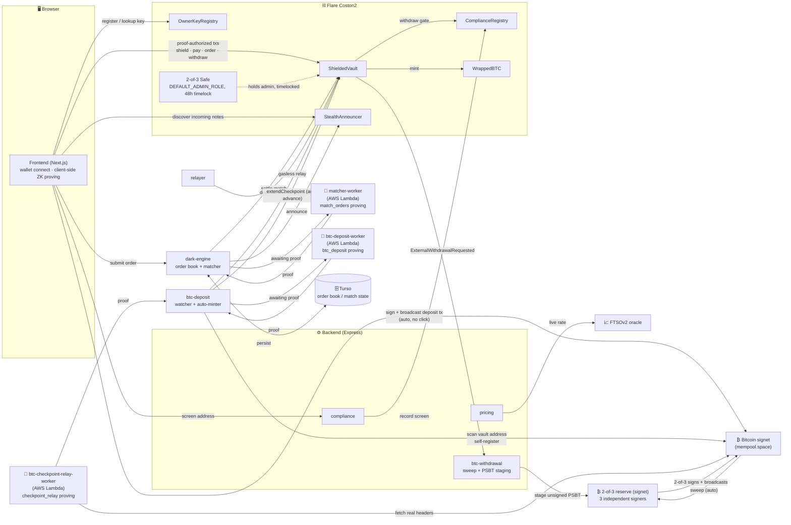

# Umbra

**UMBRA** is a next-generation decentralized dark pool built for the Flare Network. It bridges the gap between institutional-grade privacy and regulatory compliance by combining Flare's native infrastructure with modern cryptographic technologies.

[](https://github.com/davre001/UMBRA/actions/workflows/backend-ci-cd.yml)
[](https://docs-umbra.vercel.app/)
[](./LICENSE)

**PROBLEM WE SOLVE**

Public blockchains publish every trade — what you hold, what you traded, and
who you traded with. That's exactly the information that makes front-running
and MEV extraction possible. Umbra keeps balances, orders, and counterparties
private, while proving in zero knowledge — verifiable by anyone — that every
settlement followed the rules.


📖 **Full documentation:** [docs-umbra.vercel.app](https://docs-umbra.vercel.app/)

---

## Submission

Built for [Flare Summer Signal](https://dorahacks.io/hackathon/flaresummersignal/detail) —
submitted under **Bounty 2 (Confidential Compute Apps)** and **Bounty 1
(Interoperable Asset Products)**. Umbra's privacy comes from client-side ZK
proofs and on-chain encryption rather than a TEE, so it's a better literal
fit for Bounty 1 (an FXRP/FAssets DeFi integration); it's submitted under
Bounty 2 as well because its actual product shape — a confidential
orderbook with a secure, verifiably-correct matching engine — is exactly
what that track's own eligible-directions list describes.

| | |
| --- | --- |
| Target user | Privacy-conscious DeFi traders on Flare who want to swap or pay FAssets without broadcasting balances, orders, and counterparties on a public chain |
| Demo Video | *https://youtu.be/vdFu4xjAEos?si=SuGIi050CyB0wi40* |
| Live app | [umbra-flare.vercel.app](https://umbra-flare.vercel.app/) · [Testing guide](./TESTING.md) |
| Deployed on | Flare **Coston2** testnet — see [Deployed Contracts](https://docs-umbra.vercel.app/reference/contracts) |
| How it uses Flare | FAssets (FXRP) as the traded/paid asset, FTSOv2 for live matching-rate pricing, Coston2 for every write (proof-gated `ShieldedVault`, `StealthAnnouncer`, `PrivacyKeyRegistry`, `OwnerKeyRegistry`, `ComplianceRegistry`) — see [Architecture](#architecture) and [Built on](#how-it-works) |
| What's newly built | Everything — first commit `2026-07-28`, within this hackathon's development window. No pre-existing codebase. |

See [Roadmap](#roadmap) for what's next.

## Contents

- [What stays private](#what-stays-private)
- [How it works](#how-it-works)
- [Bitcoin bridge](#bitcoin-bridge)
- [Architecture](#architecture)
- [Repository layout](#repository-layout)
- [Quick start](#quick-start)
- [Backend](#backend)
- [Frontend](#frontend)
- [Status](#status)
- [Roadmap](#roadmap)
- [License](#license)

## What stays private

| | Amount | Asset | Counterparty |
| --- | --- | --- | --- |
| **Shield** (deposit) | Public | Public | — |
| **Dark pool order** | Private | Private | Private |
| **Private pay** | Private | Public | Private |
| **Withdraw** | Public | Public | Public |

Depositing into the vault is a public ERC-20 transfer — there's nothing secret
about putting money in. Everything you do *inside* the vault is private, and
what you reveal on the way out depends on which exit you take. Dark pool
orders are the strongest case: amounts **and** assets stay hidden, with only
an opaque commitment and a nullifier ever going on-chain.

Every note/order commitment is spendable the moment it's inserted — the
Merkle proof itself never reveals which leaf is yours. But *discovering* one
someone else created for you (a payment, matched dark-pool proceeds, a
partial fill's residual) needs a delivery channel, and that channel is what
actually enforces the table above: `StealthAnnouncer`'s `announce()`
metadata is ECIES-encrypted (secp256k1 ECDH + AEAD) to a key each wallet
publishes once via `PrivacyKeyRegistry`, and a `pay()` announcement's
`stealthAddress` is a one-time tag derived from that same key rather than
the recipient's real address — see
[`privacyKeys.ts`](./frontend/src/lib/noteWallet/privacyKeys.ts) and the
[Stealth Addresses docs](https://docs-umbra.vercel.app/concepts/stealth-addresses)
for the exact scheme. Two honest caveats: it degrades to the legacy
plaintext/real-address form when a counterparty hasn't published a privacy
key yet (or on a network where `PrivacyKeyRegistry` isn't deployed), and for
Private Pay specifically, only the *recipient's* address is hidden — the
sender still submits `announce()` from their own wallet, so which address
sent a private payment stays visible even though who received it doesn't.

## How it works

1. **Shield** — deposit tokens into `ShieldedVault`. A commitment to your new
   note is inserted as a leaf in an on-chain Merkle tree. No proof is needed
   yet; you're publishing a commitment, not spending one.
2. **Trade** — place an order by spending a note and inserting an opaque order
   commitment in its place. Orders rest off-chain in the dark engine's book.
   A matcher pairs compatible orders and generates a zero-knowledge proof
   that the match was computed correctly.
3. **Exit** — settle to a new shielded note, pay someone privately, or
   withdraw publicly to an address.

Matching happens off-chain, but correctness isn't a matter of trust: the
`match_orders` circuit proves the fill respected both traders' limits, and a
Solidity verifier checks that proof on-chain before the vault moves anything.
A dishonest matcher cannot produce a valid proof for an invalid match. See
[`circuits/DESIGN.md`](./contract/circuits/DESIGN.md) for the full
trust-boundary writeup, or the [Concepts docs](https://docs-umbra.vercel.app/concepts/dark-pool)
for the guided version.

**Built on:**

| | |
| --- | --- |
| Chain | Flare (Coston2 testnet) |
| ZK circuits | [Noir](https://noir-lang.org/), compiled to WASM, proven client-side with Barretenberg (server-side for `btc_deposit` — see [Bitcoin bridge](#bitcoin-bridge)) |
| Pricing | Flare Time Series Oracle (FTSOv2) |
| Compliance | `ComplianceRegistry` gates `withdraw()` today via a disclosed `ATTESTER_ROLE` placeholder, not FDC yet — see [Roadmap](#roadmap) |
| Assets | FAssets (FXRP, and more), plus real Bitcoin (signet) via a native bridge — see [Bitcoin bridge](#bitcoin-bridge) |

## Bitcoin bridge

Real signet Bitcoin bridges in as genuine, public collateral — not a
simulated or wrapped-by-trust token. Send BTC to a signet address derived
from your connected wallet; a Noir circuit (`btc_deposit`) proves that a
real, confirmed Bitcoin transaction paid the vault and carried your EVM
address in its `OP_RETURN` output, and a verified proof mints real
`WrappedBTC` (an ordinary ERC20, 8 decimals) straight to your public
balance. From there it's ordinary allowlisted collateral — shield, pay,
swap, and dark-pool all work on it exactly like FXRP or USDT0.

The whole deposit side needs zero manual steps: the Faucet page's BTC card
auto-derives your signet address on wallet connect, auto-broadcasts the
deposit transaction the moment your funding confirms (no click), and a
backend watcher independently scans the vault's own address to self-
register any deposit whose browser closed before it could report itself —
so a dropped connection can't strand funds. See
[`backend/src/btc-deposit/`](./backend/src/btc-deposit) and
[`frontend/src/app/faucet/page.tsx`](./frontend/src/app/faucet/page.tsx).

**Honest current limitation**: the circuit trusts one admin-registered
genesis "checkpoint" header as its root of trust (the same model BTC
Relay/SPV clients use — see `docs/LIMITATIONS.md` #1), and a deposit can
only be proven once that checkpoint has advanced to align with its exact
confirming block height. Every advance after genesis is permissionless and
proof-gated, not an admin action — `btc-checkpoint-relay-worker/` runs
automatically, pacing real signet block production, so a proven-but-unminted
deposit unblocks itself within roughly one signet block of the worker's own
poll interval rather than waiting on a manual operator step. That genesis
value, and the other one-time bridge-config admin actions
(`setTrustedVerifier`/`setExternalDepositToken`), are held by a real 2-of-3
Safe and gated by a 48h public timelock, not a single EOA — see
`docs/THREAT_MODEL.md` and `docs/LIMITATIONS.md` #6. See
[Roadmap](#roadmap) and
[`BTC_DEPOSIT_DESIGN.md`](./contract/circuits/BTC_DEPOSIT_DESIGN.md)'s
"Known simplifications" for the full disclosed trust model (genesis
checkpoint trust, fixed K = 6 confirmation window, no cross-fork chainwork
comparison yet, signet signer-check not verified).

### Withdrawing back to Bitcoin

Withdrawing WrappedBTC calls the same `withdraw()` every other asset uses;
for this one asset, the contract never attempts an ERC20 transfer and
instead emits `ExternalWithdrawalRequested` for an off-chain relayer
(`backend/src/btc-withdrawal/`) to fulfill on real signet. Fulfillment
funds from a real 2-of-3 P2WSH Bitcoin reserve, not a single custodian
key: real signet deposit inflow lands in a hot wallet
(`BTC_CUSTODIAN_WIF`), which a sweep loop periodically moves in full into
the reserve, and every payout is built as an unsigned PSBT that needs 2 of
3 independently-held signers to sign before it broadcasts
(`backend/scripts/sign-btc-withdrawal.ts`) — this backend can stage a
payout but never holds a key that can complete one alone. A public
solvency report (`GET /api/btc-withdrawal/solvency`) and a secret-gated
overdue-withdrawal detail route make both the reserve's real balance and
any withdrawal stuck waiting on signers independently checkable — see
[`docs/RUNBOOK_BTC_WITHDRAWAL.md`](./docs/RUNBOOK_BTC_WITHDRAWAL.md).

**Honest current limitation**: there is no automatic reclaim or payout
timeout yet — if the custodian/reserve signers are simply unavailable
(not compromised, just offline), a nullified withdrawal sits waiting with
no automatic path back to the user, only a human-operated runbook. See
`docs/LIMITATIONS.md` #7 and #8 for this and two smaller disclosed gaps
(no dedicated frontend UI for a Bitcoin withdrawal destination yet; a
narrow concurrent-withdrawal UTXO-selection race).

## Architecture



Every write to `ShieldedVault` is authorized by a ZK proof, not by who submits
the transaction — that's what lets the backend relay gaslessly and the
matcher see order details without ever being able to touch funds.

## Repository layout

```
umbra/
├── backend/              # Express + TypeScript API — dark-engine matcher, pricing, compliance, relayer, btc-deposit/btc-withdrawal
├── contract/             # Solidity contracts + Noir circuits, deployed to Coston2
├── frontend/             # Next.js 16 + React 19 app
├── matcher-worker/       # AWS Lambda — match_orders proving (server-side, EventBridge-scheduled)
├── btc-deposit-worker/   # AWS Lambda — btc_deposit proving (server-side, 1-minute poll)
├── btc-checkpoint-relay-worker/ # AWS Lambda — checkpoint_relay proving (server-side, ~10-minute poll)
└── docs/                 # Nextra docs site — docs-umbra.vercel.app
```

## Quick start

You'll need Node.js, pnpm, and a wallet with Coston2 testnet funds (use the app's
faucet page once it's running, or [Flare's own faucet](https://faucet.flare.network/)).

```bash
# Install all workspace dependencies
pnpm install

# Run backend dev server (→ http://localhost:4000)
pnpm dev:backend

# Run frontend dev server (→ http://localhost:3000)
pnpm dev:frontend
```

Full setup, wallet connection, and your first shielded deposit are walked
through in [Getting Started](https://docs-umbra.vercel.app/getting-started).

## Backend

An Express + TypeScript API backing every flow the frontend exercises. It
talks to the real, deployed Coston2 contracts and a live FTSOv2 feed — no
simulation in the request paths. The dark-engine's order book and match
records persist to a durable store (Turso) so they survive a restart;
everything else is in-memory and safely rebuildable, holding no state that
can't be freshly re-derived.

| Module | Responsibility |
| --- | --- |
| `dark-engine` | Order book: matches resting orders, assembles proof inputs, submits/settles on-chain |
| `pricing` | Live FTSOv2 midpoint rate lookup |
| `compliance` | Real on-chain address screening against `ComplianceRegistry` |
| `relayer` | Real gasless relaying — proof-authorized `ShieldedVault` writes submitted on a user's behalf |
| `btc-deposit` | Real signet chain data + fixed-template tx parsing for `btc-deposit-worker`; a poll loop that self-registers deposits the frontend never reported; auto-submits `depositExternal` once proven; also submits `btc-checkpoint-relay-worker`'s `extendCheckpoint` proofs on its behalf — see [Bitcoin bridge](#bitcoin-bridge) |
| `btc-withdrawal` | Fulfills `ExternalWithdrawalRequested` events by staging a real spending PSBT against a 2-of-3 signet reserve (this backend holds no reserve private key — see [Bitcoin bridge](#bitcoin-bridge)); publishes a public solvency + overdue-withdrawal check at `GET /api/btc-withdrawal/solvency` |

```bash
cd backend
pnpm build   # type-check and compile to dist/
pnpm start   # run the compiled build
pnpm test    # vitest suite (supertest against every route)
```

`GET /health` returns `{"status":"ok"}` once it's up; interactive API docs
are served at `/docs` (Swagger UI). See `.env.example` for required
environment variables.

## Frontend

A [Next.js](https://nextjs.org) 16 (App Router) app using React 19,
TypeScript, and Tailwind CSS v4, with `wagmi` / `viem` for wallet
connectivity, `@tanstack/react-query` for data fetching, and `framer-motion`
for animation.

| Route | Purpose |
| --- | --- |
| `/` | Landing / entry into the protocol |
| `/portfolio` | Portfolio dashboard |
| `/shield` | Deposit FAssets into shielded balances |
| `/pay` | Private pay — send, register your payment key, claim incoming payments |
| `/swap` | Dark pool trading — place, cancel, and claim orders |
| `/faucet` | Deep-links to Flare's Coston2 faucet for C2FLR/FXRP/USDT0, plus a real signet Bitcoin deposit flow — auto-derives your deposit address and auto-broadcasts once funded, no separate claim step (see [Bitcoin bridge](#bitcoin-bridge)) |

```bash
cd frontend
pnpm build   # production build
pnpm start   # run the production build
pnpm lint    # lint the codebase
```

## Testing, Verification & Code Coverage

Umbra is covered by an automated test suite spanning unit tests, formal property invariants, ZK proof corruption testing, and backend API integration tests across the monorepo.

### Verification Matrix & Test Extent

| Component | Test Files | Tests | Coverage / Extent | Key Properties Verified |
| :--- | :--- | :--- | :--- | :--- |
| **Smart Contracts** | 8 suites | **167 passing** | **91.75% lines / 88.09% statements**\* (100% on all registries, batcher & announcer) | Access-control bypasses, timelock queue/execute/cancel (all 3 gated setters, including both previously-untested cancel functions), permissionless `extendCheckpoint`, 33-byte key constraints, atomic batch partial tolerance |
| **ZK Verifiers** | `Verifiers.negative.test.ts` | **78 passing** | **94.32% lines across 6 verifiers**\* | Bit flips, truncation, 0x/0xFF payloads, mutated roots/nullifiers/amounts, BN254 scalar field overflow ($x \ge r$) |
| **Invariant Fuzzing** | `ShieldedVault.invariants.test.ts` | **8 passing** | Core vault state machine | Balance conservation ($\sum \text{in} - \sum \text{out}$), strict nullifier uniqueness (anti-replay), compliance gate enforcement |
| **Backend & SPV** | 24 suites | **158 passing (2 CI skipped)** | **82.5% overall lines / 96% app core**, 87.4% on `btc-withdrawal`, 88.6% on `btc-deposit`, 92.9% on `compliance` | SegWit non-witness serialization, Merkle inclusion proofs, FTSOv2 price feeds, watcher retry + rate-cap branches, 2-of-3 reserve derivation + PSBT sign/combine/finalize, sweep, real on-chain `StealthAnnouncer` (both plaintext and ECIES-encrypted branches)/`extendCheckpoint`/`matchOrders` submission paths, forced real-failure branches on the compliance and withdrawal-PSBT routes (see below) |
| **Monorepo CI** | `.github/workflows/ci.yml` | 4 gates | 100% workspace pass | `pnpm lint`, `pnpm typecheck`, `pnpm test`, `pnpm build` across all 7 packages |

\* Contract line/statement coverage percentages predate this session's timelock/checkpoint-relay/Safe test additions (167 passing now vs. 155 originally measured against) — a fresh `pnpm contracts:coverage` run didn't complete in time to capture final numbers for this table; re-run it for current figures.

**On backend coverage specifically**: 82.5% overall is a large jump from an earlier-measured 56.75%, achieved mostly by adding real on-chain tests (gated `it.skipIf(!!process.env.CI)`, same convention `relayer.test.ts` already established — needs a funded local `PRIVATE_KEY`, never runs in CI) for previously-untested submission paths, and by forcing genuinely untriggered error branches with real spies on real modules (`compliance.routes.ts`, `btc-withdrawal.routes.ts`) rather than fabricating them. Every file that was under 80% got individually triaged; three kinds of gap remain, and only the first two are permanent:

- **Deliberately walled off, not a gap**: `dark-engine/store.ts` (18.5%) and `btc-withdrawal/store.ts`'s own Turso passthrough functions are never exercised under `NODE_ENV=test` on purpose — this repo's own store.ts comments explain why tests must never be able to write to the real hosted database. Forcing this up would mean defeating that safety rail.
- **Blocked on the same real dependency**: `matcher.ts`, most of `submitter.ts`'s `submitMatch` success path, and `shared/scan.ts`'s `OrdersMatched` branch all need a vault Merkle tree state only reachable via live in-test Noir proving — `contract/test/ShieldedVault.test.ts` already disclosed this as out of scope for the identical reason before this session touched it. `relayer.service.ts`'s real withdraw test exists but only actually runs the first time ever against a fresh vault (a fixture-ordering constraint, not a design flaw) — it didn't land this run because the vault's tree had already moved past that state.
- **Fixed this pass**: `compliance.routes.ts` (76.5%→92.9%) and `btc-withdrawal.routes.ts` (72.3%→81.5%)'s error-handling branches, and `submitter.ts`'s encrypted-announcement branch (73.9%→78.3%, registering a real `PrivacyKeyRegistry` key for the test run rather than only ever exercising the plaintext fallback) — all ordinary gaps with no structural blocker, just not written yet before this pass.

### Running the Test Suites

```bash
# Run all tests across the entire monorepo
pnpm test

# Run smart contract tests (164 tests)
pnpm contracts:test

# Run smart contract code coverage (solidity-coverage)
pnpm contracts:coverage

# Run backend tests with code coverage (vitest v8)
pnpm backend:coverage

# Run strict type checking across all 7 packages
pnpm typecheck

# Run linting across all packages
pnpm lint
```

### Invariant & Security Properties Tested
1. **Solvency & Balance Conservation**: For any sequence of native or ERC20 deposits, the vault balance strictly matches $\sum(\text{deposits}) - \sum(\text{withdrawals})$.
2. **Strict Nullifier Uniqueness**: Any spent nullifier is permanently invalidated and rejected on replay attempts across `withdraw`, `pay`, `placeOrder`, and `depositExternal`.
3. **ZK Proof Non-Malleability**: Every UltraHonk verifier contract unconditionally rejects corrupted proofs, altered public inputs, and scalar field overflows.
4. **Compliance Screening Gate**: Withdrawals to unscreened or blacklisted addresses are blocked 100% of the time, regardless of proof validity.

## Status

Umbra runs on the **Flare Coston2 testnet**, bridging real **Bitcoin
signet** — no real funds are at risk on either chain. See
[Deployed Contracts](https://docs-umbra.vercel.app/reference/contracts) for
live addresses, and [Getting Started](https://docs-umbra.vercel.app/getting-started)
to make your first shielded deposit.

The core dark pool (shield/pay/swap/withdraw for C2FLR/FXRP/USDT0) is live
and verified end-to-end against the real deployment. The BTC bridge
described above — deposit auto-broadcast/self-registration/auto-mint,
permissionless checkpoint advancement, the 2-of-3 reserve withdrawal path,
and the Safe/timelock admin handoff — is fully built and locally tested,
but **not yet live on the deployed app**: `ShieldedVault` was redeployed
this round to add the timelock and checkpoint-relay redesign, and its
one-time bridge-config actions (trusting the deposit verifier, registering
WrappedBTC, the checkpoint genesis) are sitting in their required 48h
public timelock window before they can execute — BTC deposits and
withdrawals are unavailable on the live app until that completes and the
backend/worker deployments catch up. The rest of this README describes the
finished design, not a claim that every piece of it is live at this exact
moment; check `docs/LIMITATIONS.md` and the live app itself for current
reality.

## Roadmap

- **Cumulative-chainwork checkpoint fork choice.** `extendCheckpoint`
  (permissionless, proof-gated — see [Bitcoin bridge](#bitcoin-bridge) and
  `docs/LIMITATIONS.md` #1) currently accepts strictly linear extension
  only, with no comparison across competing forks. Full BTC-Relay-style
  "most cumulative work wins" resolution would close the remaining
  signet-specific gap where a low-effort competing fork could still race
  the honest chain.
- **Real FDC compliance verification.** `ComplianceRegistry.screen()` is
  currently gated by `ATTESTER_ROLE` — a disclosed placeholder, not a real
  attestation. Shipping this for real means swapping that access check for
  on-chain verification of a Flare Data Connector `JsonApi`/`Web2Json`
  attestation proof (sanctions status isn't a native FDC fact type, so it
  needs a real, independently-fetchable data source behind that attestation
  too), which turns `screen()` from a synchronous call into a submit → wait
  for the FDC voting round → fetch proof → verify flow. `isScreened()` and
  everything downstream in `ShieldedVault` needs no change when this lands.
- **Hide the Pay sender, not just the recipient.** `pay()`'s `announce()`
  call is submitted directly by the sender's own wallet, so `caller` on that
  event is still visible even though `stealthAddress` is now a one-time tag
  (see [What stays private](#what-stays-private)). Routing that call through
  the existing relayer would close this, at the cost of making that one step
  depend on backend uptime instead of being fully client-side.
- **BTC withdrawal timeout/reclaim path.** A nullified withdrawal has no
  automatic recourse today if the custodian/reserve signers are simply
  unavailable — see [Bitcoin bridge](#bitcoin-bridge) and
  `docs/LIMITATIONS.md` #7. Closing it for real needs either a
  double-payment-race-safe reclaim circuit or reserve-signer bonding.
- **Dedicated frontend UI for a Bitcoin withdrawal destination.** `Shield →
  Withdraw`'s destination field is EVM-address-shaped for every asset today;
  a real Bitcoin withdrawal currently needs a hand-computed `hash160`
  pasted into that same field rather than a real `tb1q...` address typed in
  directly — see `docs/LIMITATIONS.md` #8.
- **Checkpoint-relay liveness observability.** Withdrawal staleness is
  publicly checkable (`overdueCount`/`oldestOverdueMs` on the solvency
  report), but nothing yet compares the tracked BTC checkpoint height
  against the real signet tip and surfaces the gap if
  `btc-checkpoint-relay-worker` stalls — see `docs/LIMITATIONS.md` #8.

## License

MIT — see [LICENSE](./LICENSE). Courtesy of the Hacknest Team (Web3Nova).
